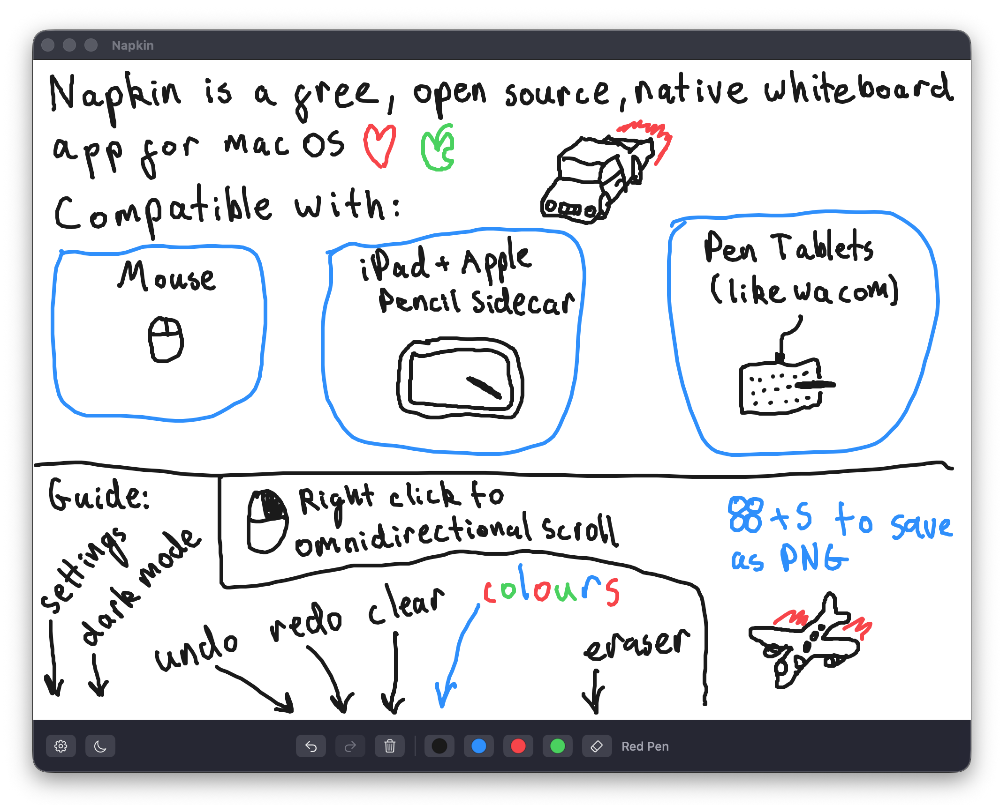

# Napkin



Napkin is a tiny macOS whiteboard for quick thinking, sketching, and ink-first notes. It gives you a large canvas, simple pen colors, an eraser, undo/redo, clear with undo, image export, Apple Sidecar support, and pen-tablet-friendly omnidirectional scrolling.

## Download

Download the latest `Napkin.dmg` from the Releases page, open it, and drag `Napkin.app` into `Applications`.

Napkin is currently unsigned. The first time you open it, macOS may block it because it cannot verify the developer. If that happens:

1. Open `System Settings`.
2. Go to `Privacy & Security`.
3. Find the message about Napkin being blocked.
4. Click `Open Anyway`.

You can also right-click `Napkin.app`, choose `Open`, then confirm you want to open it.

## Features

- Large canvas that starts in the middle so you can pan in every direction.
- Dark mode that swaps the canvas and primary pen rendering without changing stroke data.
- Persistent default mode preference in Settings.
- Black, blue, red, and green pens.
- Eraser with cursor preview.
- Undo and redo, including undoing Clear.
- Export the visible canvas or the full drawn area as PNG.
- Works with Apple Sidecar for sketching from an iPad.
- Hold right click or middle click and hover away from the starting point to continuously scroll.

## Build From Source

Requirements:

- macOS 13 or newer
- Swift 6 or newer
- Xcode command line tools

Run the app directly:

```sh
swift run Napkin
```

Build a `.app` bundle:

```sh
scripts/build-app.sh
open .build/Napkin.app
```

Build a release `.dmg`:

```sh
scripts/package-dmg.sh
open .build/Napkin.dmg
```

## Status

Napkin is early software. It is intentionally small, local-only, and focused on the drawing loop.

## Source Code

The source code is available at [github.com/alex-k03/napkin](https://github.com/alex-k03/napkin).

## Author

Created by Alexander Kharchenko.

## License

Napkin is open source software released under the MIT License. See [LICENSE](LICENSE).
